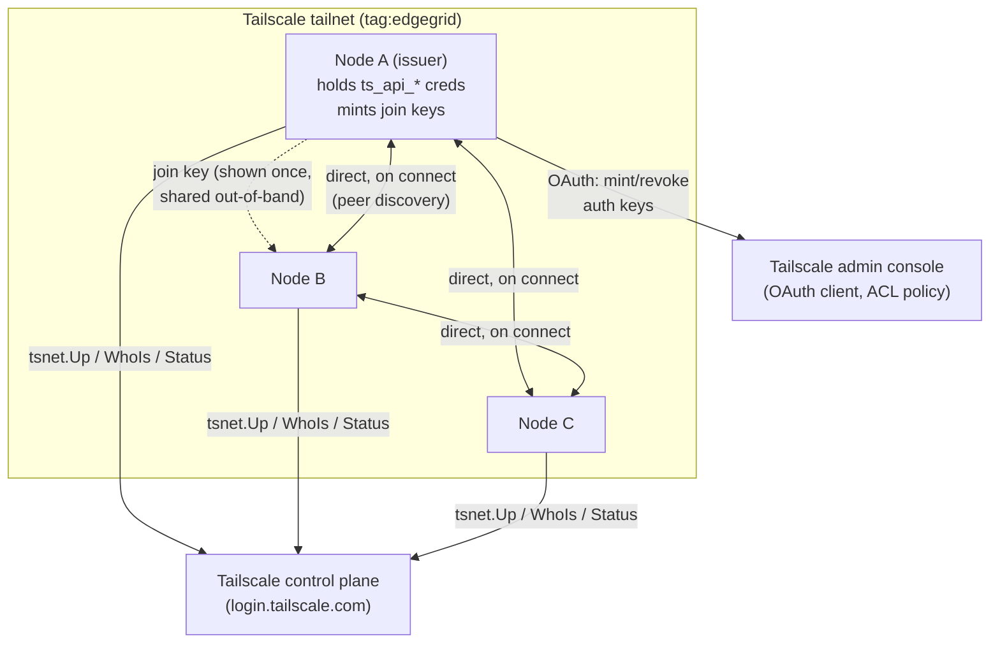

# Architecture

What EdgeGrid is today, after the `22acea4`/`f702286`/`5a1aac7` strip commits
removed the coordinator, NATS, worker, and job-dispatch system that used to
live here. If you're reading old commit history or a stale mental model:
there is no coordinator, no NATS, no job queue, no worker approval. All of
that is gone. This doc describes what replaced it.

## The one-sentence version

Every node runs the same binary, joins a Tailscale tailnet, and — once peer
discovery lands — talks to other EdgeGrid nodes directly over that tailnet.
There is no central server anywhere in the design.

## Why Tailscale instead of a custom network layer

This was researched, not assumed — see "Alternatives considered" below. The
short version: two nodes on two home networks, both probably behind NAT
(sometimes CGNAT), cannot just start talking. Something has to solve
discovery and NAT traversal before WireGuard's encryption is even relevant.
Tailscale (via the `tsnet` library, embedded — not the external client) gives
us that for free:

- **Membership** — `tsnet.Server.LocalClient().Status()` returns every
  device on the tailnet, online or not, with IPs, DNS names, and ACL tags.
  No API calls, no credentials.
- **Peer identity** — `LocalClient().WhoIs(addr)` attributes any inbound
  connection to a tailnet node. Connection = authenticated identity, for
  free.
- **Transport** — `tsnet.Listen` / `tsnet.Dial` give plain `net.Listener` /
  `net.Conn`. WireGuard, NAT traversal, and DERP-relay fallback all happen
  underneath; application code never touches any of it.
- **Onboarding** — a tagged, single-use, pre-authorized auth key (minted via
  the Tailscale API) is how a new node joins. No custom invite system.

## Component map

```
cmd/edgegrid/            entry point — up | dashboard | logs | profile
internal/node/           tsnet lifecycle, config, identity, profiles, token files
internal/tailscaleapi/   OAuth client: mint/revoke tailnet auth keys
internal/discovery/      membership snapshot, listener, hello exchange over the tailnet
internal/sysstat/        CPU/memory load, one build-tagged file per OS
internal/blob/           chunked, hashed transfer of large opaque payloads
internal/tui/            welcome screen, boot progress, dashboard (bubbletea)
internal/planner/        (stub) turns a request into a plan — not yet implemented
internal/executor/       (stub) does the work a plan describes — not yet implemented
```

`internal/planner` and `internal/executor` are single `doc.go` files today —
declared intent, no code.

`internal/discovery` is built and merged: nodes find each other and exchange
identity on connect ([`peer-discovery.md`](peer-discovery.md)).
`internal/blob` transfers files between nodes today: manifest, chunk
framing, verified receive, and live progress in both directions
([`blob-transfer.md`](blob-transfer.md)). Resume, retry and a request
protocol are not built. It sits deliberately *beside*
`executor` rather than inside it: `executor` knows about files on disk,
`blob` only knows how to move bytes, so anything else that later needs to
move a large payload doesn't have to pretend to be an artifact first.

## Process shape (ASCII)

One node, start to finish:

```
                      edgegrid dashboard
                             |
                             v
                    +-------------------+
                    |  welcome screen   |   (internal/tui/app)
                    |  pick a profile   |
                    +-------------------+
                             |
                profile already joined? ----no----+
                             |                     |
                            yes                    v
                             |          +-----------------------+
                             |          |  network role screen  |
                             |          |  new network / join   |
                             |          +-----------------------+
                             |                     |
                             |           (join: paste an auth key,
                             |            or fall back to browser login)
                             |                     |
                             v                     v
                    +-------------------------------------+
                    |            boot screen               |
                    |  node.NewWithLogging -> tsnet.Up      |
                    |  (shows the login URL if one appears) |
                    +-------------------------------------+
                             |
                             v
                    +-------------------+        +------------------------+
                    |     Node          |------->| tailnet (WireGuard,    |
                    |  tsnet.Server     |        | NAT traversal, DERP    |
                    |  node.id          |        | relays — all opaque)   |
                    +-------------------+        +------------------------+
                             |
                             v
                    +-------------------+
                    |     dashboard      |   Overview | Peers | Tokens
                    |  (bubbletea TUI)   |   (Tokens only if this node
                    +-------------------+    holds ts_api_* credentials)
```

Two node roles exist today, and they're not stored — they're derived:

- **Issuer** — a node with `ts_api_client_id` / `ts_api_client_secret` /
  `ts_api_tailnet` configured (Settings). It can mint join keys
  (`tailscaleapi.CreateKey`) and its dashboard shows the Tokens tab. Nothing
  else is special about it — it is not on any data path, it just controls
  who can join.
- **Everyone else** — same binary, same capabilities, no credentials to mint
  keys with.

## Network diagram (Mermaid)



The dotted arrow is the only thing that ever leaves the tailnet as sensitive
material — a join key, shown once, never persisted. Everything else (the
solid double arrows) is node-to-node over `tsnet.Dial`/`tsnet.Listen`, peer
identity free via `WhoIs`.

## Credentials on disk today

One 0600 file per value under the profile's data dir (`node.SaveToken` /
`node.LoadToken`) — no schema, no database. This table replaces the old
`docs/security/token-inventory.md`, which described NATS/coordinator secrets
that no longer exist.

| File | Written by | Read by | Sensitive? |
|---|---|---|---|
| `node.id` | `node.LoadOrCreateIdentity` | dashboard, logs | No — identifier, not secret |
| `tailscale.ip` | `node.New`, after `tsnet.Up` succeeds | welcome screen (`profileHasJoined`) | No |
| `tsnet/` (dir) | `tsnet.Server` itself | `tsnet.Server` on later starts | Device identity — copying it lets a process present as that device |
| `ts_api_client_id` / `ts_api_client_secret` | Settings form | `tailscaleapi.LoadCredentials` | Secret can mint/revoke tailnet join keys |
| `ts_api_tailnet` | Settings form | `tailscaleapi.LoadCredentials` | No — which tailnet to mint in |
| `ts_api_tag` | Settings form | `tailscaleapi.CreateKey` | No — ACL-relevant, not secret |
| `api_port`, `require_approval` | Settings form | nothing yet | No — reserved, currently inert |
| Minted auth key | `tailscaleapi.CreateKey` | shown once in Tokens tab, never written to disk | Grants tailnet join until used or revoked |

## Platform support

Linux, macOS and Windows all build and run. Almost nothing in the codebase
is OS-specific — `tsnet`, the blob transfer, and the TUI are portable as
written — with two exceptions worth knowing about:

- **Machine stats** (`internal/sysstat`) are read differently per OS, so
  each has its own build-tagged file. Linux reads `/proc/stat` and
  `/proc/meminfo`. Windows calls `GetSystemTimes` and `GlobalMemoryStatusEx`
  from kernel32. macOS has no per-CPU tick counter reachable without cgo, so
  CPU load there is derived from the load average — an approximation that
  counts uninterruptible-wait threads as busy and lags a spike by up to a
  minute; memory combines `hw.memsize` with `vm_stat`'s page counts.
- **File permissions are not enforced on Windows.** `node.SaveToken` writes
  `0600`, which is a no-op there, so the files in the credentials table
  above — including `ts_api_client_secret`, which can mint tailnet join keys
  — rely on the parent directory's inherited ACLs rather than on the mode
  EdgeGrid asks for.

## Alternatives considered

Before settling on `tsnet`, three shapes were on the table (this section is
what survives from the old `docs/research-serverless.md`, which is otherwise
removed as superseded):

1. **Roll a custom STUN/hole-punch/relay layer.** Rejected — reinvents NAT
   traversal, which is exactly the kind of infrastructure problem not worth
   owning.
2. **Embed something Tailscale-like (`tsnet`), accepting a hosted
   control-plane dependency** — or self-host via Headscale later if that
   dependency becomes a problem. **Chosen.**
3. **Uncloud-style fully decentralized mesh** (github.com/psviderski/uncloud)
   — no control plane at all, membership propagates peer-to-peer from a
   direct SSH join. Closest philosophically to "no central server," but its
   exact NAT-traversal mechanism was unverified at research time, and it
   would mean building a discovery layer instead of reusing one that already
   works. Revisit if the Tailscale control-plane dependency ever becomes a
   real constraint.

The deciding factor was deployment reality: nodes are consumer machines on
home networks, likely behind NAT and possibly CGNAT — not cloud VMs with
public IPs. That rules out anything assuming stable, publicly reachable
addresses.

## What's not built yet

- [`peer-discovery.md`](peer-discovery.md) — nodes finding each other and
  exchanging identity. **Built and merged**; the doc also records what was
  explicitly deferred, including periodic re-sync and declarative task
  placement.
- [`blob-transfer.md`](blob-transfer.md) — moving a large payload between
  two nodes: chunked, hashed against a manifest agreed in advance, and
  eventually resumable. **In progress** — manifest generation, its wire
  encoding, and the TUI flow for picking a peer and hashing a file are
  done; the intent field, chunk framing, sender, receiver and resume are
  not. Open decisions are listed there rather than guessed at here.
- **Task dispatch** — declarative placement ("A publishes desired state, B
  reconciles"), the thing `internal/planner` exists for. Still unproposed;
  see peer-discovery.md's deferred section for why it needs its own design
  pass rather than being an extension of either doc above.
