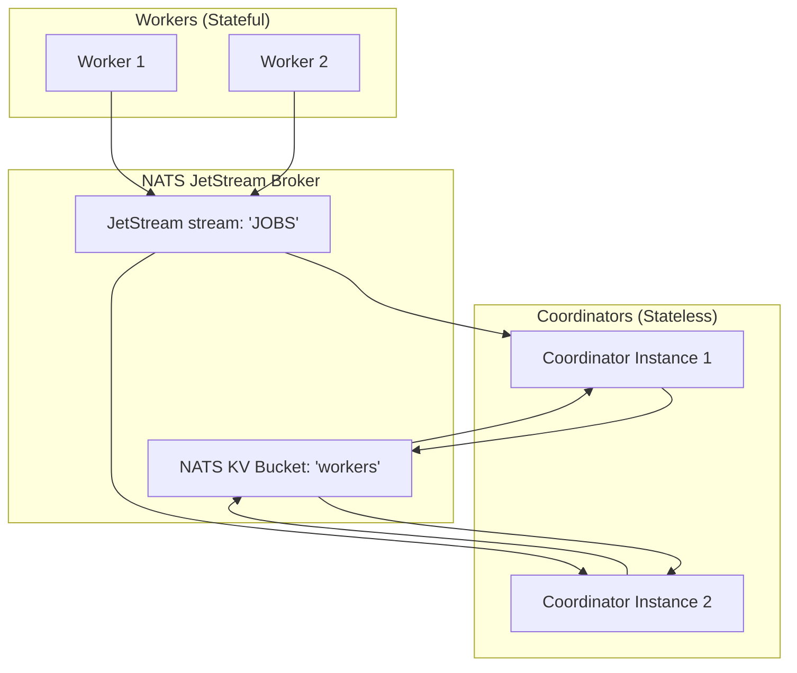

# Distributed State Walkthrough: NATS KV Integration

This walkthrough details how the `distributed-kv` branch transitions the EdgeGrid coordinator from using an in-memory worker registry to a distributed, stateless model using NATS JetStream's Key-Value (KV) store.

---

## Architecture Overview



By storing worker records in a NATS KV bucket rather than local Go maps, multiple coordinators can run concurrently. Any instance can process heartbeats, register new nodes, or assign jobs because they all share the same source of truth in NATS.

---

## 1. NATS KV Client Setup

We added a helper to **`internal/broker/broker.go`** to retrieve or initialize the Key-Value bucket.

```go
// GetOrCreateKV creates or retrieves a Key-Value bucket
func (b *Broker) GetOrCreateKV(bucket string, ttl time.Duration) (nats.KeyValue, error) {
	kv, err := b.JS.KeyValue(bucket)
	if err != nil {
		// Bucket might not exist, create it with a custom Time-To-Live (TTL)
		kv, err = b.JS.CreateKeyValue(&nats.KeyValueConfig{
			Bucket: bucket,
			TTL:    ttl,
		})
		if err != nil {
			return nil, fmt.Errorf("failed to create KV bucket %s: %w", bucket, err)
		}
	}
	return kv, nil
}
```

---

## 2. Stateless Worker Manager

In **`internal/coordinator/workerman/manager.go`**, the `WorkerManager` struct was stripped of its mutex (`sync.Mutex`) and local `map[string]*Worker`. It now directly wraps the `nats.KeyValue` client.

```go
type WorkerManager struct {
	kv nats.KeyValue
}

func NewWorkerManager(jsBroker *broker.Broker) (*WorkerManager, error) {
	// We set a 1-minute TTL. If a worker fails to send a heartbeat 
	// within 60 seconds, NATS automatically expires and deletes its key.
	kv, err := jsBroker.GetOrCreateKV("workers", 1*time.Minute)
	if err != nil {
		return nil, err
	}

	return &WorkerManager{
		kv: kv,
	}, nil
}
```

---

## 3. Distributed Registration & State Updates

### Registration (`registerWorker.go`)
When a worker boots, it publishes to `workers.register`. The coordinator receiving this event marshals a `Worker` record (including supported models and capabilities) into JSON and writes it to the KV bucket:

```go
func (wm *WorkerManager) RegisterWorker(ctx context.Context, info *workerpb.WorkerInfo) error {
	worker := &Worker{
		Info:           info,
		LastSeen:       time.Now(),
		State:          WorkerFree,
		SupportedModel: info.SupportedModel,
	}

	data, err := json.Marshal(worker)
	if err != nil {
		return fmt.Errorf("failed to marshal worker: %w", err)
	}

	// Persists to KV under the worker's ID (e.g. workers.worker-1)
	_, err = wm.kv.Put(info.Id, data)
	return err
}
```

### Heartbeats (`manager.go`)
When a heartbeat arrives, the receiving coordinator pulls the current state from KV, updates the state field (`free` or `busy`) and timestamp, and saves it back:

```go
func (wm *WorkerManager) SetWorkerState(workerID string, state string) {
	entry, err := wm.kv.Get(workerID)
	if err != nil {
		return // Ignore heartbeat if worker is not registered
	}

	var worker Worker
	if err := json.Unmarshal(entry.Value(), &worker); err != nil {
		return
	}

	worker.State = state
	worker.LastSeen = time.Now()
	if state == WorkerFree {
		worker.Job = nil
	}

	data, err := json.Marshal(worker)
	if err != nil {
		return
	}

	_, _ = wm.kv.Put(workerID, data) // Refreshes the 1-minute NATS TTL window
}
```

---

## 4. Reaping Dead Workers (`checkHealth.go`)

Because the NATS Key-Value store enforces a 1-minute TTL, we no longer need an active looping thread to sweep and detect dead workers. NATS handles this automatically.

```go
func (wm *WorkerManager) StartHealthChecker(ctx context.Context, interval time.Duration) {
	// Rely on NATS KV TTL auto-reaping window
	log.Printf("🩺 Distributed health checking: relying on NATS KV TTL auto-reaping (TTL: 1m)")
}
```
