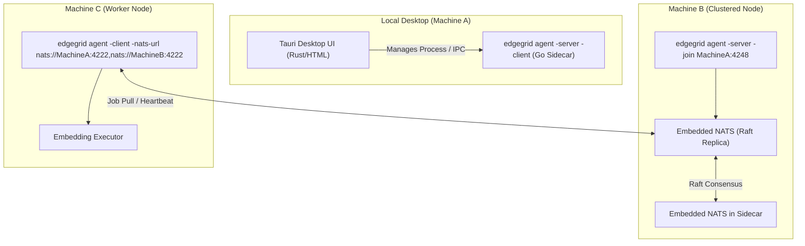

# EdgeGrid: Unified P2P Agent Architecture & Implementation Plan

This document outlines the architectural changes and step-by-step implementation plan to transition **EdgeGrid** from a microservice deployment into a **unified P2P agent model** (similar to HashiCorp Nomad/Consul) with a **Tauri + Rust Desktop Dashboard**.

---

## 1. Architectural Goals

1. **Unified Binary**: Build and distribute a single Go binary (`edgegrid`) instead of separate `coordinator` and `worker` binaries.
2. **Zero-Dependency Clustering**: Embed NATS JetStream server directly inside the binary to eliminate external Docker requirements for message queuing and Raft replication.
3. **Role-Based Execution**: Allow nodes to run as a **Server (Coordinator)**, **Client (Worker)**, or **Both (Development/Single-Node)** using CLI flags.
4. **Decentralized High Availability**: Allow multiple server nodes on different physical machines to automatically cluster via NATS's built-in Raft engine to replicate the job queues and worker states.
5. **Cross-Platform Desktop Control Plane**: A lightweight Tauri-based desktop app (written in Rust/HTML/JS) that manages local agent execution and visualizes the cluster state.

---

## 2. P2P Agent & Tauri Topology



---

## 3. Directory Layout Restructuring

```text
edgegrid/
├── cmd/
│   └── edgegrid/                # Main Go entrypoint
│       └── main.go              # Bootstraps Go CLI commands
├── internal/
│   ├── agent/                   # Agent runner (server/client orchestration)
│   ├── natsdb/                  # Embedded NATS server controller and clustering setup
│   ├── coordinator/             # Coordinator engine (formerly apps/coordinator)
│   ├── worker/                  # Worker engine (formerly apps/worker)
│   └── proto/                   # Shared Protobuf definitions
├── ui/                          # Tauri Desktop GUI
│   ├── src-tauri/               # Rust backend
│   │   ├── src/main.rs          # Handles sidecar process and NATS sync
│   │   └── tauri.conf.json      # Configuration & Sidecar bindings
│   └── src/                     # Frontend UI (Svelte / React)
├── go.mod
└── Makefile
```

---

## 4. Technical Design

### A. Embedding NATS Server in Go
Instead of running NATS via Docker, the binary imports the NATS server package:
```go
import (
	"github.com/nats-io/nats-server/v2/server"
)
```
We configure it programmatically to enable JetStream and set up clustering:
```go
opts := &server.Options{
    Host:      "0.0.0.0",
    Port:      4222,
    Cluster: server.ClusterOpts{
        Port: 4248, // Cluster routing port
    },
    JetStream: true,
    StoreDir:  "/var/lib/edgegrid/nats", // JetStream storage directory
}
```

### B. Unified CLI Interface
We will use standard Go CLI flags (or Cobra) to enable roles:
```bash
# Run a single-node setup (Both server and client on same machine)
edgegrid agent -server -client

# Run a dedicated, clustered server
edgegrid agent -server -cluster-port 4248 -routes nats://other-node:4248

# Run a dedicated worker connecting to the cluster
edgegrid agent -client -nats nats://seed-node:4222
```

### C. Tauri Sidecar & Rust Integration
1. **Go Sidecar Integration**: Tauri compiles the Go `edgegrid` binary as a sidecar process and launches it when the UI boots.
2. **Rust NATS Subscriber**: Tauri's Rust backend uses the `async-nats` crate to connect to the NATS cluster and subscribe to events (e.g. `workers.heartbeat`, `jobs.results`). It streams these events to the Javascript frontend via Tauri events (`app_handle.emit()`).
3. **IPC Bridge**: The Javascript UI triggers system-level controls (e.g., stopping the agent, editing configuration, triggering query benchmarks) via Tauri's Rust IPC commands (`invoke`).

---

## 5. Step-by-Step Implementation Plan

### Step 1: Unify the Workspace Module
1. Create a root `go.mod` for `github.com/edgegrid/edgegrid`.
2. Move `apps/shared/proto` to `internal/proto`.
3. Consolidate dependencies (NATS client, Protobuf, NATS Server) into the root `go.mod`.

### Step 2: Implement Embedded NATS Controller (`internal/natsdb`)
1. Create `internal/natsdb/server.go`.
2. Add a `StartEmbeddedNATS(opts *Options)` function that launches NATS and configures JetStream.
3. Add helper methods to handle clustering (joining nodes by resolving seed routes).

### Step 3: Refactor Coordinator and Worker into Internal Packages
1. Move `apps/coordinator` code to `internal/coordinator`.
2. Update coordinator initialization so it can accept an in-process or external NATS connection.
3. Move `apps/worker` code to `internal/worker`.

### Step 4: Build the `internal/agent` Orchestrator
1. Create `internal/agent/agent.go` to hold the roles configuration:
   ```go
   type Config struct {
       ServerEnabled bool
       ClientEnabled bool
       NatsURL       string
       SupportedModels []string
       // ...
   }
   ```
2. Implement the lifecycle method:
   - If `ServerEnabled`: Start Embedded NATS ➔ Run Coordinator.
   - If `ClientEnabled`: Initialize Executor ➔ Run Worker Agent.

### Step 5: Implement CLI Entrypoint (`cmd/edgegrid/main.go`)
1. Setup a flag-parsing interface to read CLI variables or config files.
2. Setup OS signal catching (`SIGINT`, `SIGTERM`) to trigger graceful shutdown of both the embedded NATS server and the client/server agents.

### Step 6: Bootstrapping Tauri & Rust Desktop Console (`ui/`)
1. Run `cargo tauri init` inside the project to bootstrap the `ui` workspace.
2. Configure `tauri.conf.json` sidecars to bind the compiled Go `edgegrid` binary as a child process.
3. Implement Rust commands in `ui/src-tauri/src/main.rs` to start NATS event subscriptions (using `async-nats` crate) and forward status updates to the frontend window.
4. Build the Web Visualizer (using React/Svelte and vanilla CSS):
   * **Node Map**: Visualized graph of the peer network nodes and their status (using heartbeats).
   * **Execution Terminal**: Console to submit text and view real-time embedding results and speeds.
   * **Metrics Panel**: Charts showing system RAM/CPU and queue throughput.
