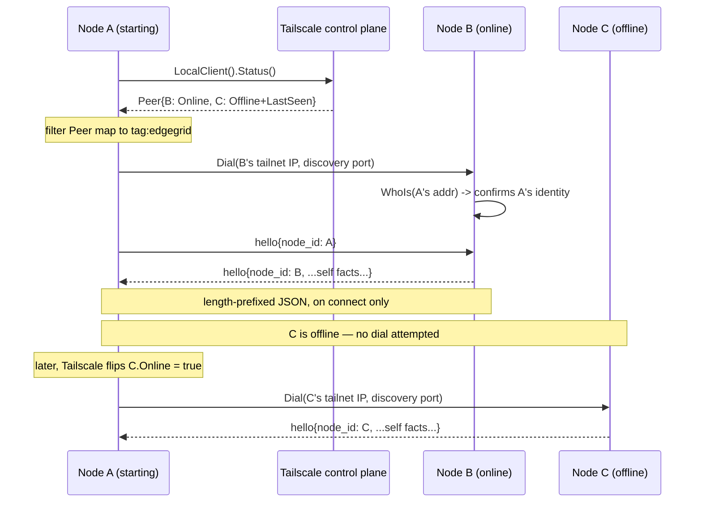
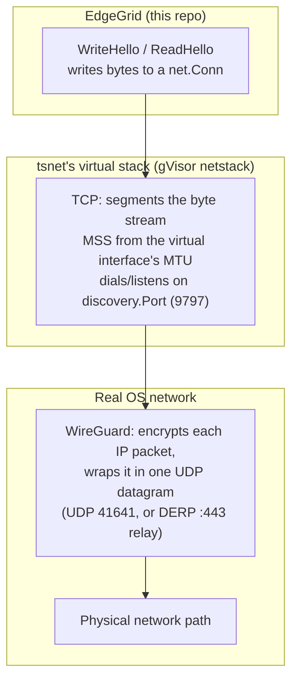

# Peer discovery

How EdgeGrid nodes find each other and exchange state, now that there is no
coordinator to ask. See [`architecture.md`](architecture.md) for the system
this sits inside.

## The question that started this

`plan.md` originally asked "how do seeds in BitTorrent work?" — the answer
turned out to be the wrong question for this system. BitTorrent needs a
tracker/DHT because it has *no membership authority*: peers are anonymous and
untrusted. EdgeGrid already has one — the Tailscale control plane knows
exactly who's on the tailnet. The real design work was figuring out what to
build on top of that, and what not to.

## Decisions

| Decision | What, and why |
|---|---|
| **Membership source** | `tsnet.Server.LocalClient().Status().Peer`, filtered to `tag:edgegrid`. Free — no API calls, no credentials. Includes offline peers (`Online`, `LastSeen`), so a restarting node immediately knows every peer that exists, not just the reachable ones. |
| **Transport** | `tsnet.Listen` / `tsnet.Dial`. WireGuard, NAT traversal, DERP fallback all invisible underneath. |
| **Peer identity** | `LocalClient().WhoIs(remoteAddr)` on any inbound connection. No auth to build. |
| **Authority model** | A node authors facts about **itself only**. No node asserts anything about another. This is what makes conflict resolution unnecessary rather than deferred — two nodes can never disagree about a fact, because only one of them is ever allowed to state it. |
| **No gossip** | Rejected, deliberately, for this scale. Gossip's value is relaying third-party facts through intermediaries; the authority model above means there are no third-party facts to relay — A can just ask C directly. At N ≤ 10, a full-mesh direct ask costs about the same as a gossip round and has no convergence question to answer. Revisit if any of: N grows past ~100, a real need for third-party observations shows up, nodes can't all reach each other, or the fact set gets large. None of those are true today. |
| **View persistence** | None. Rebuilt on every start — membership is free from Tailscale, and application facts are re-asked from whichever peers are reachable. Avoids an entire category of staleness bugs (stale-on-disk vs. actually-true-now). |
| **Exchange trigger** | On connect. A timer/periodic re-sync is deferred, not rejected — add it once "on connect" proves insufficient in practice. |
| **Health** | Tailscale's `Online` field, full stop. No separate heartbeat or liveness protocol. "Online but EdgeGrid isn't answering" is a real gap this doesn't cover — deliberately out of scope for this slice. |
| **Encoding** | Length-prefixed JSON over the `tsnet.Dial`/`Listen` connection. Boring on purpose — no protobuf/gRPC dependency for a payload this small at this N. |
| **Listen port** | Fixed, well-known, same on every node. Configurable-per-node was considered and rejected: it's circular (you'd need to already be talking to a peer to learn its port, which is the problem discovery is solving). Fixed costs nothing here because every node has its own tailnet IP — there's no shared-host collision to avoid, which is the usual reason to make a port configurable. |
| **Issuer, not coordinator** | The node holding `ts_api_*` credentials is called *issuer*, never *coordinator*. It names a capability (it can mint join keys), not a rank, and it's plural-safe — two issuers need no election. Critically, it is not on any data path: if it's offline, existing nodes still discover and talk to each other, you just can't onboard a new one until it's back. The moment anything routes *through* it for anything besides minting, that's the coordinator pattern creeping back in — watch for it. |
| **Scope: connectivity first** | This slice proves nodes find each other and exchange something over an authenticated channel. Artifact inventory, capabilities, and task state are explicitly the *next* slice — see below. |

## Explicitly deferred (do not build yet)

- **Task dispatch.** "A tells B to do X" is a fact about B authored by A —
  it breaks the authority model above and reopens the conflict-resolution
  problem. The direction floated: **declarative**, not imperative. A
  publishes desired state ("I want artifact X on B"); B owns and reports its
  own actual state; reconciliation is B noticing the gap and closing it. A
  down node isn't a delivery failure to retry, it's just a gap that closes
  whenever B comes back. This needs its own proposal before any code —
  bilateral in-memory intent doesn't survive a restart, which conflicts with
  `internal/executor`'s stated resume requirement, so at least one side has
  to persist something and the design has to say what.
- **A timer/periodic re-sync** on top of on-connect exchange.
- **Application-level health** beyond Tailscale's `Online`.
- **`api_port` config field** — currently inert in the settings form. Stays
  inert under a fixed port; revisit only if a real need for a per-node
  override shows up.

## Sequence (Mermaid)

Node A starting up and discovering node B, who is online, and node C, who
isn't (yet):

## Transport: what actually crosses the wire

"`tsnet.Dial`/`tsnet.Listen`" above is doing a lot of hiding. Worth being
precise about what's underneath it, because two different ports and two
different network stacks are involved, and conflating them is an easy
mistake — this section exists because that mistake got made and corrected
mid-session.

**tsnet is not the OS network stack.** `tsnet.Server` runs Tailscale's own
userspace TCP/IP implementation (gVisor's netstack) entirely in-process —
there's no real kernel `tun`/`utun` device, no real interface visible to
`ip addr`. `discovery.Port` (9797) is a TCP port inside *that* virtual
stack. It never appears as a port number on the real network — a `tcpdump`
on the actual NIC would never show it.

**WireGuard's real transport port is a separate, lower layer**, entirely
outside our code. Tailscale's default is UDP 41641 for a direct
peer-to-peer path, falling back to DERP relay (over 443) when a direct path
isn't reachable. We don't configure this, don't read it, and changing
`discovery.Port` has zero effect on it — they don't interact.

**Why TCP segments never threaten WireGuard's UDP budget.** WireGuard adds
roughly 60 bytes of overhead per packet (UDP header + WireGuard's own
header/auth tag). If TCP produced segments sized for a full 1500-byte
Ethernet MTU, the resulting UDP datagram could exceed what some real paths
can carry — the classic VPN failure mode: ICMP "fragmentation needed" gets
eaten by a firewall (common), the sender never learns to shrink packets, and
a connection that handshakes fine hangs the moment real data flows. Tailscale
avoids this by advertising a conservative MTU (believed to be 1280 bytes,
matching IPv6's guaranteed minimum — not independently verified against the
exact vendored version in this build) on tsnet's virtual interface. TCP's
own MSS negotiation, running entirely inside that virtual stack, then never
produces a segment large enough to risk it — both ends of a `tsnet`-to-
`tsnet` connection agree on this independently, so it isn't dependent on
live path-MTU discovery succeeding.

None of this is a live concern for `Hello` (well under 30 bytes). It becomes
worth re-checking the day a large payload (artifact transfer, task dispatch
state) rides this same channel — see the deferred section above.

## Task breakdown

Ordered so each step is independently testable and the next can't start
meaningfully without it.

### 1. Membership snapshot — done
Read `Status().Peer`, filter to the EdgeGrid tag, expose it as a typed list
(node ID / public key, tailnet IP, `Online`, `LastSeen`). No networking of
our own yet — this only proves we can see what Tailscale already knows.
**Done when:** a `edgegrid dashboard` run against ≥2 joined nodes lists both,
correctly marking which is online.

### 2. Discovery listener — done
`tsnet.Listen` on the fixed port. Accept connections, `WhoIs` the remote
address, log the identified peer. No payload yet — just proves the channel
opens and identity resolution works.
**Done when:** node A can `Dial` node B's fixed port and B logs "connection
from `<A's node ID>`" using `WhoIs`, not a value A sent.

### 3. Hello exchange — done
Length-prefixed JSON `hello` message, exchanged both directions on connect.
Payload starts minimal — node ID and little else — since this slice is about
proving the channel, not the content.
**Done when:** A and B each print the other's self-reported node ID after
one connect/exchange/close cycle.

### 4. Wire into node startup — done
On `Node.Start` (today just `<-ctx.Done()`), launch the listener and, for
every peer the membership snapshot reports online, dial and exchange hello.
**Done when:** starting a third node against two already-running ones causes
all three to log full pairwise discovery with no manual dialing.

Landed for both entry points — `edgegrid node` (already had it) and
`edgegrid dashboard` (didn't; see below). One real gap the "done when"
above doesn't cover: dialing only happens once, at startup, against
whoever `Snapshot()` reports online *right then*. A peer that comes online
later isn't discovered until *it* dials *this* node — asymmetric, not
full mesh. The deferred periodic re-sync (above) is what closes this.

### 5. Surface it in the TUI — done
A `Peers` tab in the dashboard shows `Snapshot()` live, refreshed every 5s.
Deliberately reads Tailscale's membership view directly rather than a
record of completed hello exchanges — there's no store for the latter yet
(still an open, unproposed piece of work), and the raw membership view is
enough to make the feature visible and to unblock debugging peer-visibility
problems, which is what actually drove building this now.

Steps 1–3 have no dependency on each other's *content* but a hard dependency
on order — 2 needs nothing from 1, 3 needs 2's connection open. Building
2 and 3 together is reasonable; 1 can happen in parallel or first.

Task dispatch (the deferred section above) starts only after step 4 is
solid and merged — it's a second subsystem built on top of a working first
one, not a continuation of the same PR.
