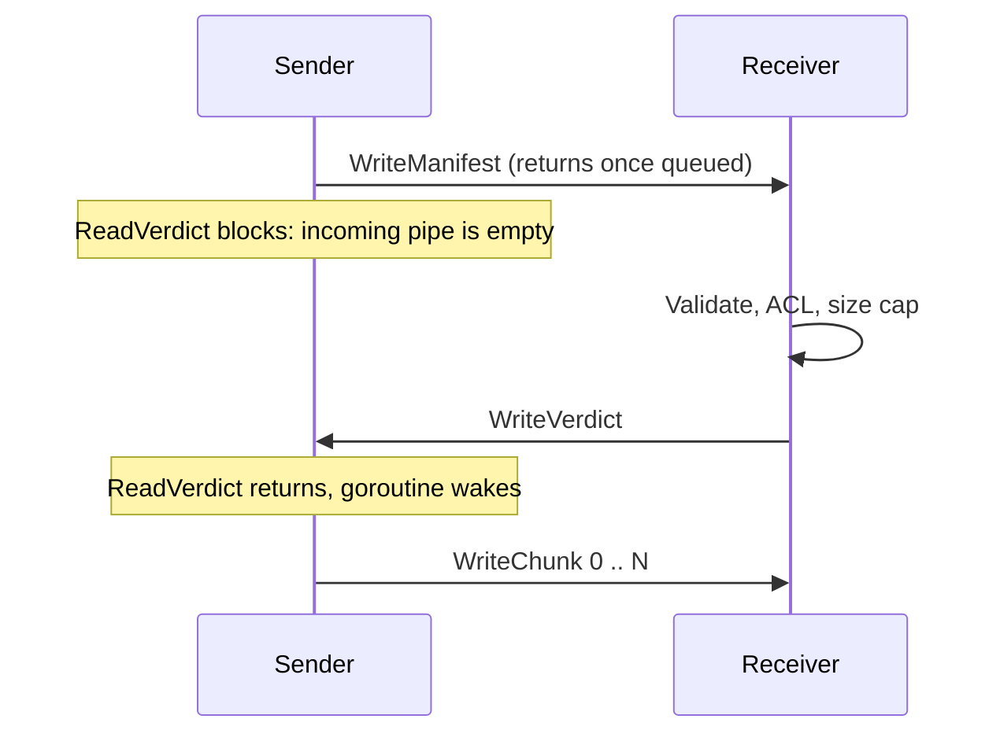

# Two pipes: what a connection is, and where the sender waits

Code: [`Send` / `Receive` in chunk.go](../../internal/blob/chunk.go),
[`verdict.go`](../../internal/blob/verdict.go). Next:
[framing](framing.md). Index: [reading](README.md).

## A connection is two one-way pipes

A TCP connection is **full duplex**: two independent one-way byte streams,
one in each direction. Each has its own sequence numbers, its own send and
receive buffers, and its own flow-control window. Bytes written one way never
mix with bytes travelling the other, so there is no byte-level collision to
design around.

```
      Node A                                            Node B
  ┌────────────┐                                    ┌────────────┐
  │            │ ── A's writes ───────────────────> │            │
  │  net.Conn  │    A's send buffer -> B's recv buf │  net.Conn  │
  │  (handle)  │                                    │  (handle)  │
  │            │ <─────────────────── B's writes ── │            │
  └────────────┘    B's send buffer -> A's recv buf └────────────┘
```

If you think in Go channels, it is a pair of channels, one per direction,
bundled behind a single value. The difference is what flows: a channel
carries discrete values, while these pipes carry a raw **byte stream with no
message boundaries** — which is the whole reason [framing](framing.md)
exists.

## What `net.Conn` and `io.ReadWriter` are

`net.Conn` is not a third channel. It is one **handle** onto both pipes, and
it has two methods that matter here:

- `Write(p)` drops bytes into the outgoing pipe.
- `Read(p)` takes bytes out of the incoming pipe.

`io.ReadWriter` is only the Go interface that says "this thing has both":

```go
type ReadWriter interface {
    Reader   // Read(p []byte) (n int, err error)
    Writer   // Write(p []byte) (n int, err error)
}
```

`Send` and `Receive` take that interface instead of a `net.Conn` so the
identical code runs over a real tailnet connection and over `net.Pipe()` — an
in-memory duplex pair — in the tests. `Send` used to take an `io.Writer`; it
takes a `ReadWriter` now because the sender has to *listen* for the verdict as
well as talk.

## Where it waits

There is no special wait mechanism. It is an ordinary blocking read.

- **`Write` doesn't wait for the peer.** It copies bytes into the send buffer
  and returns. `WriteManifest` returning tells you the bytes were queued, not
  that anyone has read them.
- **`Read` waits when the incoming pipe is empty.** The goroutine parks — Go
  parks the *goroutine*, not the OS thread, so blocking is cheap and the TUI
  keeps redrawing — until one of three things happens:
  1. bytes arrive,
  2. the connection closes (`Read` returns `io.EOF`: the peer closed its
     write direction),
  3. the deadline passes (`Read` returns a timeout error).

That is the entire "wait for the verdict": `ReadVerdict` is an `io.ReadFull`
on a pipe with nothing in it yet.

```
sender                                     receiver
  │── WriteManifest ─────────────────────> │ ReadManifest
  │   ReadVerdict: incoming pipe empty,    │ Validate, ACL, size cap
  │   goroutine parked                     │
  │ <───────────────────── WriteVerdict ── │
  │   ReadVerdict returns                  │
  │── WriteChunk 0 .. N ─────────────────> │ ReadChunk, verify, WriteAt
```



## Two pipes rule out collisions, not deadlock

If both sides write a large amount and neither reads, both send buffers fill,
both `Write` calls block, and nothing ever drains them. No crash, no error —
two hung goroutines, until a deadline fires.

The protocol avoids it by **strict turn-taking**: at any moment one side
writes while the other reads, and they swap only at the verdict.
`discovery.ExchangeAsDialer` follows the same rule (its comment: *the dialer
speaks first, so both sides never write into a full buffer at once*).

The rule to carry forward: any new message that **both** sides could send at
the same time needs either an explicit order, or a separate goroutine doing
the reading. This will matter the day a request/pull protocol exists, because
"receiver asks for chunk 7 while sender is still streaming chunk 5" is
exactly a both-write case.

## Closing is per direction too

TCP can close one direction while the other stays open (a FIN). Go exposes
that as `CloseWrite` on `*net.TCPConn`. This code doesn't use it — it closes
the whole connection when a transfer ends — but it is why a `Read` returning
`io.EOF` means "the peer stopped writing", not necessarily "the connection is
gone".

## How this breaks

- **The verdict wait shares the transfer's deadline.** `SendBlob` sets one
  30-minute deadline before calling `Send`, so a receiver that accepts the
  connection, reads the manifest and then goes silent leaves the sender
  parked in `ReadVerdict` for up to 30 minutes. Deciding accept-or-refuse
  takes microseconds, so that wait should have its own short deadline — say
  15–30 seconds — with the long one restored for the chunk phase. Not done.
- **A stalled receiver mid-transfer looks the same.** The sender blocks in
  `Write` (see [flow control](flow-control.md)) until the same deadline;
  nothing distinguishes "slow" from "stuck".
- **Buffer sizes aren't a number to rely on.** They vary by OS and stack and
  can be auto-tuned, so "how much can I write before it blocks" has no fixed
  answer. Design so the answer doesn't matter.
